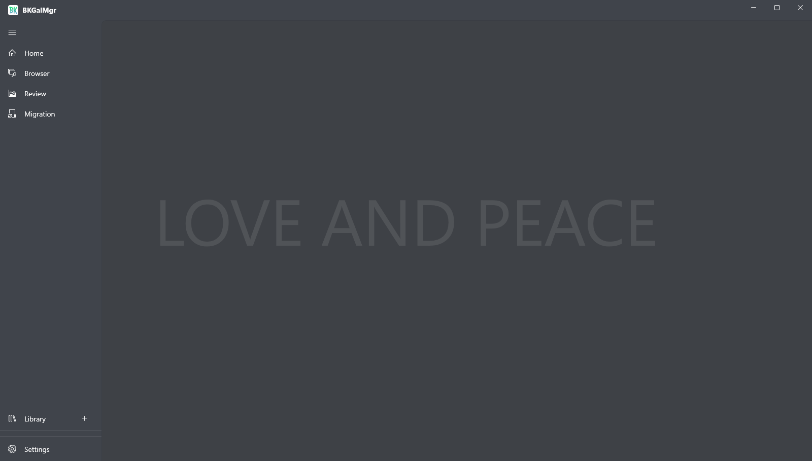

<br>
<p align="center">
  
</p>
<h1 align="center">BKGalMgr</h1>

<div align="center">

[](./LICENSE)
[](https://github.com/bluelaze/BKGalMgr/contributors)
[](https://github.com/bluelaze/BKGalMgr/releases)
[](https://github.com/bluelaze/BKGalMgr/releases)

</div>

<div align="center">

**English** | [简体中文](./README_ZH.md) 

</div>


BKGalMgr, unified management of local games, support for configuring multiple local folders as a repository, record game information, generate game versions, visualize and record your play time, searchable, groupable and sortable games, convenient for you to be a hamster.



## Guide

### Download

Release: https://github.com/bluelaze/BKGalMgr/releases

Minimum Windows version: `Win10 1809(10.0.17763.0)`.

### Repository structure

```
/(repository_folder)                    // Repository folder
    repositoryinfo.json                 // Repository configuration file, fixed name

    (yyyyMMddTHHmmssZ)                  // Game folder, use the creation time to name it
        gameinfo.json                   // The game configuration file

        /sources                        // The game sources folder, fixed name
            (yyyyMMddTHHmmssZ)          // Folder for one of the game's sources, use the creation time to name it
                sourceinfo.json         // Source configuration file, fixed name
                source.zip              // The source of the game is created by zipping all the files, fixed name

        /localizations                  // Game localizations folder, fixed name
            (yyyyMMddTHHmmssZ)          // Folder for one of the game's localizations, use the creation time to name it
                localizationinfo.json   // Localization configuration file, fixed name
                localization.zip        // The localization of the game is created by zipping all the files, fixed name

        /targets                        // Game targets folder, fixed name
            (yyyyMMddTHHmmssZ)          // Folder for one of the game's targets, use the creation time to name it
                targetinfo.json         // Target configuration file, fixed name
                /target                 // Target folder, unzip or copy all files to generate, fixed name
                    (StartupName)       // In the game's target, a startup program must exist

        /savedatas
            savedatasettingsinfo.json   // Game savedatas folder, fixed name
            (yyyyMMddTHHmmssZ)          // Folder for one of the game's savedatas, use the creation time to name it
                savedatainfo.json       // SaveData configuration file, fixed name
                savedata.zip            // The savedata of the game is created by zipping all the files, fixed name

    (yyyyMMddTHHmmssZ)
    ......
```

BKGalMgr itself only stores the path to the root directory of the repository, it does not record any information in the repository. When opening the repository, it will open the repository according to the directory structure designed above, and the repository itself is built by scanning the game through the directory layer by layer according to the directory structure at the time of opening.

In other words, BKGalMgr actually manages a repository statelessly, completely disconnecting it when it is closed and connecting it when it is opened again.

With this directory-based management design, you can do some repository management on your own after BKGalMgr is closed, with folder granularity for additions, deletions, and modifications - **note that you shouldn't be able to move files around unless you're familiar enough with what they mean**.

### Manage

When you first start up, you should select a folder as your repository in the Manage page and add a game.

Under the game level, there are three part:

#### Source

Optional, select a folder containing all the files of the game, specify the name of the launcher in the root directory of this folder, when added it will compress all the files in the game folder into a zip and save them to the game directory of the repository.

#### Localization

Optional, select a folder containing all the files for localizing the game, adding it will compress all the files in the localization folder into zip and save them to the games directory in the repository.

#### Target

Required, there are two ways to build:

 - You can choose an existing source and localization to build, it will decompress the source first and then decompress the localization to overwrite it.
 - You can select a folder containing all the files of the game, configure the launcher, and when you add it, it will **move** this folder to the game directory in the repository.

The second way makes it easy to build this without creating the source and localization, but note that it's a direct **move** folder build, which means that if the folder is on the same disk as the repository, all the files will be moved directly to the repository, and the **original folder will be cleared**, for the sake of reducing non-essential copying.

If you don't want to copy the original game and want to use some of BKGalMgr's features, there's a piece of cold knowledge that can help you -- Shortcut is a file actually, and you can copy the game's shortcut to create.

### Library

Once the repository and games have been created, you can select the repository in the library page. On this page, you can see all the games in the repository and can search, group and sort them.

When you need to start a game, you need to select a book and click `Run` to start the configured startup program and start the timer, or pause the timer if you leave in the middle of the game, and automatically stop the timer when the game is closed.

That's the basics of how to use it, and there are a few other little features you can explore on your own.

## Development

Feel free to submit your changes, especially for interface beautification and project optimization.

If you want to modify an existing feature or add a new feature, please new [Issues](https://github.com/bluelaze/BKGalMgr/issues), and for some discussions or Q&A, please go to [Discussions](https://github.com/bluelaze/BKGalMgr/discussions).

### Framework

- Visual Studio 2022
- WinUI3

### Coding style

For the code specification of c#, you can refer to the [C# Style Guide](https://github.com/godotengine/godot) by [godot](https://docs.godotengine.org/zh_CN/stable/tutorials/scripting/c_sharp/c_sharp_style_guide.html), but there are some differences in actual usage:

- Use line breaks (`CRLF`) for line breaks.
- Use `UTF-8` encoding with byte order markers (`BOM`).
- c# uses [CSharpier](https://csharpier.com/) formatting.
- xaml uses [XamlStyler](https://github.com/Xavalon/XamlStyler) formatting.
- xaml control naming principle is control type ending underscore naming method, for example: `add_Button`, if you want to add events, first set the control name in the use of vs auto-generate event name.
- Default use `Binding` instead of `x:Bind` in `DataTemplate`, `x:Bind` has some hidden usage tips, but can be used if necessary.
- Unnecessary, don't use and don't throw exceptions. `try catch` should not be used unless it is necessary, try to use as many judgment statements as possible for preprocessing instead of relying on `exception`, and if you want to use `try catch`, reduce the scope of `try` as much as possible or encapsulate the use of `try`.
- In principle, a class should store code blocks in an orderly manner according to the type of functionality, and should consider the functional aggregation of code, rather than inserting it in an unorganized manner.

For some other c# specifications, you can refer to godot.

The project structure is developed using the MVVM model , not so strict , `Event` can be used, but UI operations should only be in the `View`, others should only be in the `ViewModel`(Model: ?), the modules should be based on the **Low Coupling, High Cohesion** design principles .

**Note:** Please use English for comments and commit logs, code needs to be formatted when submitting, and commit logs should be submitted in `type(scope): message` format.

### Acknowledgments

### Project and community

Thanks to all the projects and communities used in this project:

- [Microsoft WinUI](https://github.com/microsoft/WindowsAppSDK)
- [CommunityToolkit](https://github.com/CommunityToolkit/Windows)
- [DotNet-Discussions](https://github.com/BYJRK/DotNet-Discussions)
- [Magpie](https://github.com/Blinue/Magpie)
- [ShareX](https://github.com/ShareX/ShareX)
- ...

### Contributors

Ciallo～(∠・ω< )⌒☆

<!-- ALL-CONTRIBUTORS-LIST:START - Do not remove or modify this section -->
<!-- prettier-ignore-start -->
<!-- markdownlint-disable -->

<!-- markdownlint-restore -->
<!-- prettier-ignore-end -->

<!-- ALL-CONTRIBUTORS-LIST:END -->
