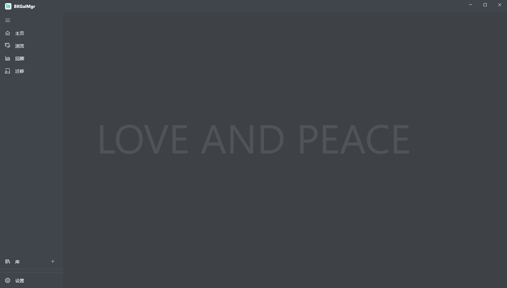

<br>
<p align="center">
  
</p>
<h1 align="center">BKGalMgr</h1>

<div align="center">

[](./LICENSE)
[](https://github.com/bluelaze/BKGalMgr/contributors)
[](https://github.com/bluelaze/BKGalMgr/releases)
[](https://github.com/bluelaze/BKGalMgr/releases)

</div>

<div align="center">

[English](./README.md) | **简体中文**

</div>

BKGalMgr，统一的管理本地游戏，支持配置多个本地文件夹作为仓库，记录游戏信息，生成游戏版本，可视化的记录你的游玩时间，可对游戏进行搜索，分组，排序，方便你当一只仓鼠。



## 指南

### 下载

下载地址：https://github.com/bluelaze/BKGalMgr/releases

Windows系统最低版本：`Win10 1809(10.0.17763.0)`。

### 仓库结构

```
/(repository_folder)                    // 仓库文件夹
    repositoryinfo.json                 // 仓库配置文件

    (yyyyMMddTHHmmssZ)                  // 游戏文件夹，使用创建时间命名
        gameinfo.json                   // 游戏配置文件

        /sources                        // 游戏 源 文件夹，名称固定
            (yyyyMMddTHHmmssZ)          // 游戏其中一个 源 的文件夹，使用创建时间命名
                sourceinfo.json         // 游戏 源 配置文件，名称固定
                source.zip              // 游戏 源 创建时，把所有文件压缩后自动生成，名称固定

        /localizations                  // 游戏 本地化 文件夹，名称固定
            (yyyyMMddTHHmmssZ)          // 游戏其中一个 本地化 的文件夹，使用创建时间命名
                localizationinfo.json   // 游戏 本地化 配置文件，名称固定
                localization.zip        // 游戏 本地化 创建时，把所有文件压缩后自动生成，名称固定

        /targets                        // 游戏 本 文件夹，名称固定
            (yyyyMMddTHHmmssZ)          // 游戏其中一个 本 的文件夹，使用创建时间命名
                targetinfo.json         // 游戏 本 配置文件，名称固定
                /target                 // 游戏 本 创建时，把所有文件解压或者拷贝后自动生成，名称固定
                  (StartupName)         // 游戏 本 里，必须存在一个启动程序

        /savedatas
            savedatasettingsinfo.json   // 游戏 存档 配置文件，名称固定
            (yyyyMMddTHHmmssZ)          // 游戏其中一个 存档 的备份文件夹，使用创建时间命名
                savedatainfo.json       // 游戏 存档备份 配置文件，名称固定
                savedata.zip            // 游戏 存档备份 创建时，把所有文件压缩后自动生成，名称固定

    (yyyyMMddTHHmmssZ)
    ......
```

BKGalMgr本身只存储仓库的根目录路径，不会记录仓库里的任何信息，当打开仓库时，会按照上面设计的目录结构去打开仓库，而仓库本身也是在打开时根据目录结构，通过一层层的目录扫描游戏，完成仓库的构建。

也就是BKGalMgr实际上对一个仓库的管理，在关闭时，就完全断开，再次打开时，才会连上，是无状态的。

在这个基于目录来管理的设计下，你完全可以在BKGalMgr关闭后，自己做些仓库的管理，文件夹粒度的进行增删改——**注意不应该随意动里面的文件，除非你足够熟悉这些文件的含义**。

### 管理

首次启动后，应该在管理界面选择一个文件夹作为你的仓库，添加一个游戏。

在游戏层级下，有三个功能：

#### 源

可选，选择一个包含游戏所有文件的文件夹，指定这个文件夹根目录下的启动程序名称，添加时会把游戏文件夹里的所有文件压缩成zip，保存到仓库的游戏目录里。

#### 本地化

可选，选择一个包含对游戏本地化所有文件的文件夹，添加时会把本地化文件夹里的所有文件压缩成zip，保存到仓库的游戏目录里。

#### 本

必须，有两种构建方式：

 - 可选择已有的源和本地化进行构建，会先解压源再把本地化解压覆盖进去。
 - 可选择一个包含游戏所有文件的文件夹，配置启动程序，添加时会把这个文件夹**移动**到仓库的游戏目录里。

第二种方式可方便的构建本，而不需要创建源和本地化，但注意是直接**移动**文件夹来构建，这意味着如果文件夹和仓库在同个磁盘下，那么所有文件会直接移动到仓库下，**原本的文件夹会被清空**，这是出于减少非必要复制的考虑。

如果你不想复制原本的游戏，又想使用BKGalMgr的一些功能，那么有个冷知识可以帮到你——快捷方式其实是一个文件，你可以复制游戏的快捷方式来创建本。

### 库

当创建好仓库和游戏后，就可以在库的界面里选择仓库了，在这个页面，你可以看到仓库里的所有游戏，并且可以进行搜索，分组，排序。

当需要启动游戏，你需要选择一个本，然后点击`运行`就会拉起配置好的启动程序，并开始计时，如果中途离开，也可暂停计时，当游戏关闭时，会自动停止计时。

这就是基础的使用，其余还有些小功能，可自行探索下。

## 开发

欢迎提交你的更改，尤其界面美化，项目优化这块的，非常欢迎。

如果你要对现有功能做修改，或者增加新功能，请先发个[Issues](https://github.com/bluelaze/BKGalMgr/issues)，一些讨论或者答疑，请到[Discussions](https://github.com/bluelaze/BKGalMgr/discussions)。

### 框架

- Visual Studio 2022
- WinUI3

### 编码规范

c#的代码规范，可以参考[godot](https://github.com/godotengine/godot)的[C# 风格指南](https://docs.godotengine.org/zh_CN/stable/tutorials/scripting/c_sharp/c_sharp_style_guide.html)，但实际使用上会有些区别：

- 使用换行符(`CRLF`)来换行。
- 使用带字节顺序标记(`BOM`) 的`UTF-8`编码。
- c#使用[CSharpier](https://csharpier.com/)格式化。
- xaml使用[XamlStyler](https://github.com/Xavalon/XamlStyler)格式化。
- xaml控件命名原则是控件类型结尾的下划线命名法，例如：`add_Button`，如果要添加事件，先设置控件名称在利用vs自动生成事件名。
- `DataTemplate`里默认使用`Binding`，而不是`x:Bind`，`x:Bind`有些隐藏的使用问题，但有必要也可使用。
- 非必要，不用和不抛异常。`try catch`非必要不应使用，尽量多的使用判断语做预处理，而不是依赖`exception`，如果要使用`try catch`，尽可能的减少`try`的范围或进行封装来使用。
- 一个类原则上按功能类型有序存放代码块，应考虑代码功能聚合，不应无序插入。

其他的c#一些规范，可以参考godot的。

项目结构上是采用的MVVM模式开发的，没那么严格，`Event`该使用就使用，但涉及UI的操作只应该在`View`，其余业务只应该在`ViewModel`（Model：？），各个模块应该基于**低耦合，高内聚**的设计原则。

**注意：** 代码提交时需要格式化，提交记录请使用`type(scope): message`的格式提交。

## 鸣谢

### 项目和社区

感谢在本项目中使用到的所有项目和社区：

- [Microsoft WinUI](https://github.com/microsoft/WindowsAppSDK)
- [CommunityToolkit](https://github.com/CommunityToolkit/Windows)
- [DotNet-Discussions](https://github.com/BYJRK/DotNet-Discussions)
- [Magpie](https://github.com/Blinue/Magpie)
- [ShareX](https://github.com/ShareX/ShareX)
- ...

### 贡献者

Ciallo～(∠・ω< )⌒☆

<!-- ALL-CONTRIBUTORS-LIST:START - Do not remove or modify this section -->
<!-- prettier-ignore-start -->
<!-- markdownlint-disable -->

<!-- markdownlint-restore -->
<!-- prettier-ignore-end -->

<!-- ALL-CONTRIBUTORS-LIST:END -->
